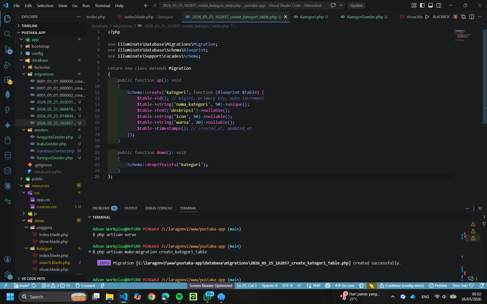
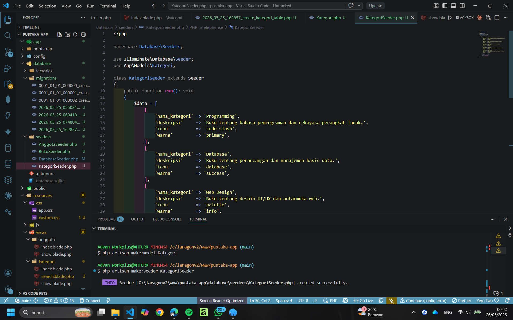
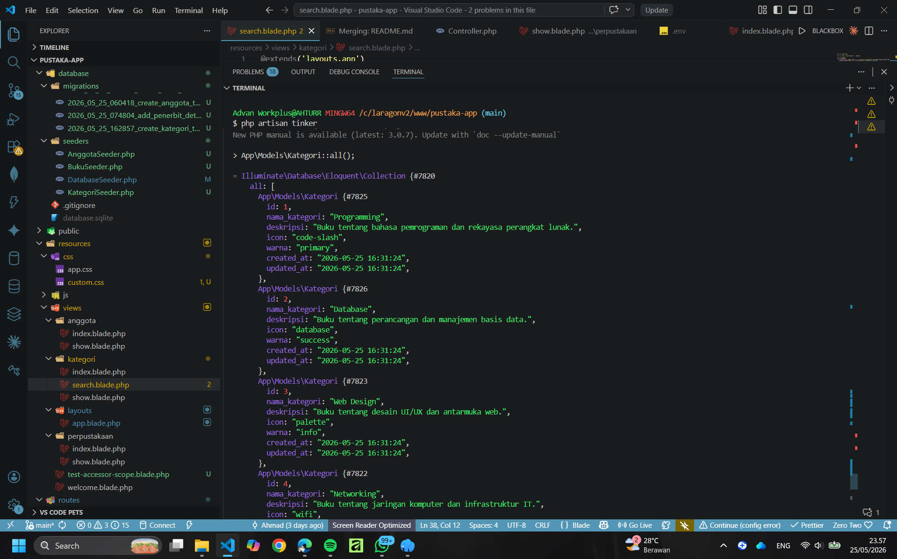
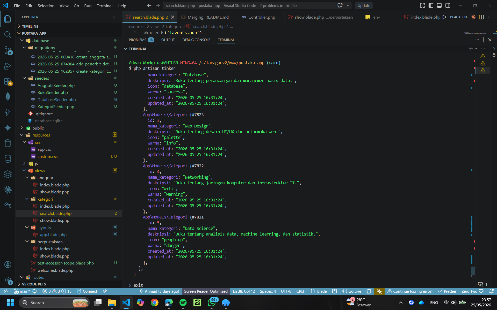
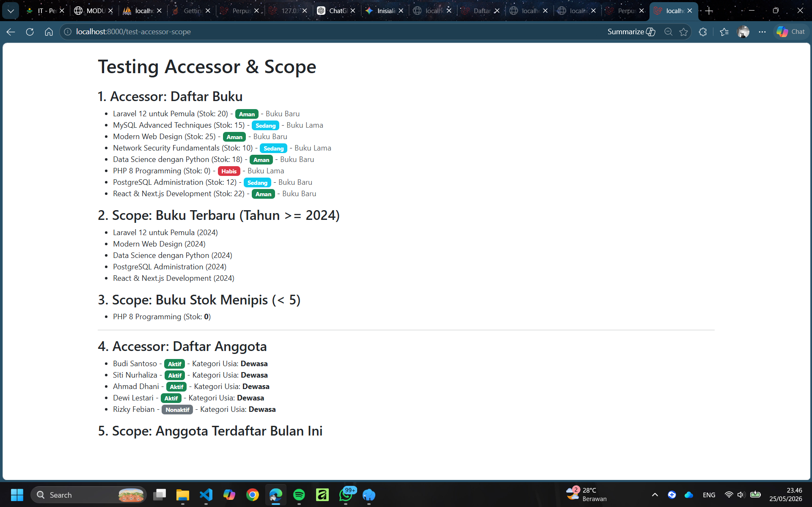
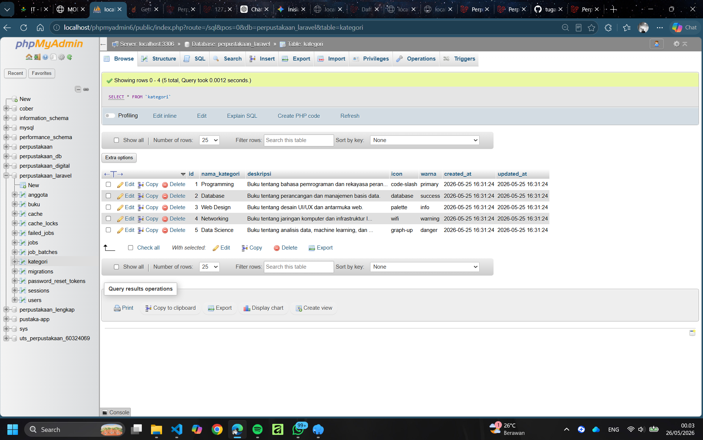

# Tugas 2 - MVC Laravel Pemrograman Web 2 Pertemuan 10

Sistem Perpustakaan berbasis Laravel dengan implementasi Accessor dan Scope pada Model Eloquent.

## 📋 Daftar Isi

- [Fitur](#fitur)
- [Teknologi](#teknologi)
- [Instalasi](#instalasi)
- [Screenshot](#screenshot)

---

## ✨ Fitur

### 1. **Database Migration**

Membuat struktur database dengan menggunakan migration Laravel.



### 2. **Database Seeding**

Mengisi data dummy ke database menggunakan seeder.



### 3. **Hasil Testing**

Testing accessor dan scope pada Model Eloquent.





### 4. **Route Testing**

Testing route dengan akses accessor dan scope.



### 5. **Database View**

Visualisasi data dari database.



---

## 🛠️ Teknologi

- **Framework:** Laravel 13.9.0
- **PHP Version:** 8.4.12
- **Database:** MySQL
- **Frontend:** Bootstrap 5.3.0
- **ORM:** Eloquent

---

## 📦 Instalasi

### Prerequisites

- PHP 8.3+
- Composer
- MySQL/MariaDB
- Node.js (opsional)

### Langkah-langkah

1. **Clone Repository**

```bash
git clone https://github.com/AHTURRR/tugas2-mvc-laravel_PemWeb2_pertem-10.git
cd tugas2-mvc-laravel_PemWeb2_pertem-10
```

2. **Install Dependencies**

```bash
composer install
npm install
```

3. **Setup Environment**

```bash
cp .env.example .env
php artisan key:generate
```

4. **Database Configuration**
   Edit `.env` dan sesuaikan dengan database Anda:

```
DB_CONNECTION=mysql
DB_HOST=127.0.0.1
DB_PORT=3306
DB_DATABASE=perpustakaan_laravel
DB_USERNAME=root
DB_PASSWORD=
```

5. **Run Migration & Seeding**

```bash
php artisan migrate
php artisan db:seed
```

6. **Start Development Server**

```bash
php artisan serve
```

Akses aplikasi di: `http://localhost:8000`

---

## 🎯 Testing Endpoint

- **Accessor & Scope:** `http://localhost:8000/test-accessor-scope`
- **Database Test:** `http://localhost:8000/test-db`
- **Daftar Buku:** `http://localhost:8000/perpustakaan`
- **Daftar Anggota:** `http://localhost:8000/anggota`

---

## 📚 Implementasi
# pertemuan-11_PemWeb2
# pertemuan-12_PemWeb2
