# 📚 Pustaka App

<div align="center">

**Modern Library Management System built with Laravel 13**

Aplikasi Sistem Informasi Perpustakaan berbasis Laravel yang dirancang untuk membantu proses pengelolaan buku, anggota, peminjaman, pengembalian, hingga penyajian laporan secara efisien melalui dashboard yang informatif dan antarmuka yang sederhana.


</div>

---

# ✨ Fitur Unggulan

## 📊 Dashboard Analytics

Dashboard menyajikan informasi secara real-time sehingga admin dapat memantau kondisi perpustakaan dengan cepat.

**Menampilkan:**

* Total Buku
* Buku Tersedia
* Buku Habis
* Total Anggota
* Anggota Aktif
* Total Transaksi
* Buku Sedang Dipinjam
* Buku Dikembalikan
* Buku Terlambat
* Total Denda
* Grafik Transaksi Bulanan
* Statistik Buku
* Riwayat Transaksi Terbaru
* Buku Terbaru
* Anggota Terbaru

---

## 📚 Manajemen Buku

* CRUD Buku
* Detail Buku
* Pencarian Buku
* Filter Kategori
* Manajemen Stok
* Bulk Delete
* Export Data Buku

---

## 👥 Manajemen Anggota

* CRUD Anggota
* Detail Anggota
* Status Aktif / Nonaktif
* Pencarian Data
* Export Data Anggota

---

## 📖 Sistem Peminjaman

* Peminjaman Buku
* Generate Kode Transaksi Otomatis
* Validasi Ketersediaan Stok
* Pengurangan Stok Otomatis
* Penentuan Tanggal Pengembalian Otomatis
* Riwayat Transaksi

---

## 🔄 Sistem Pengembalian

* Pengembalian Buku
* Update Status Otomatis
* Penambahan Stok Buku
* Perhitungan Denda Otomatis
* Mencegah Pengembalian Ganda

---

## 💰 Sistem Denda

* Perhitungan keterlambatan otomatis
* Denda berdasarkan jumlah hari keterlambatan
* Informasi total denda pada transaksi
* Rekap denda pada laporan

---

## 📈 Laporan

* Filter berdasarkan tanggal
* Filter status transaksi
* Filter anggota
* Statistik laporan
* Export PDF

---

## 🔍 Pencarian Data

Memudahkan admin menemukan data buku, anggota maupun transaksi dengan cepat melalui fitur pencarian.

---

## ⚡ Otomatisasi Sistem

Beberapa proses dijalankan secara otomatis oleh sistem.

* Generate kode transaksi
* Update stok buku
* Perhitungan tanggal kembali
* Perhitungan denda
* Update status transaksi
* Statistik dashboard secara real-time

---

# 🖼️ Tampilan Aplikasi

> **Catatan:** Simpan seluruh gambar pada folder `screenshots/` agar README dapat menampilkannya dengan benar.

## 🔐 Login

Halaman autentikasi pengguna sebelum mengakses sistem.

```md
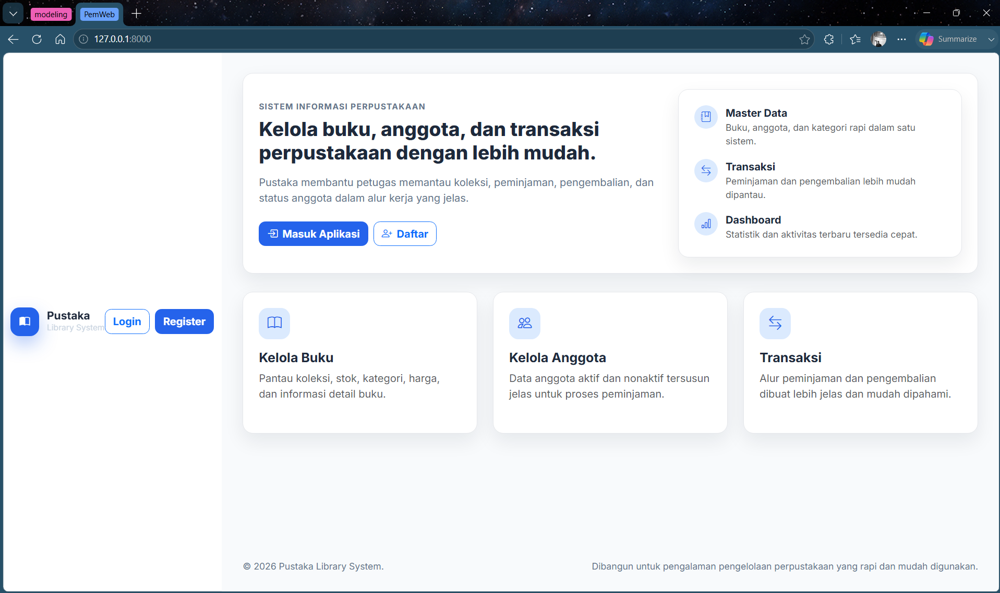
```

---

## 📊 Dashboard

Menampilkan ringkasan aktivitas dan statistik utama sistem perpustakaan.

```md
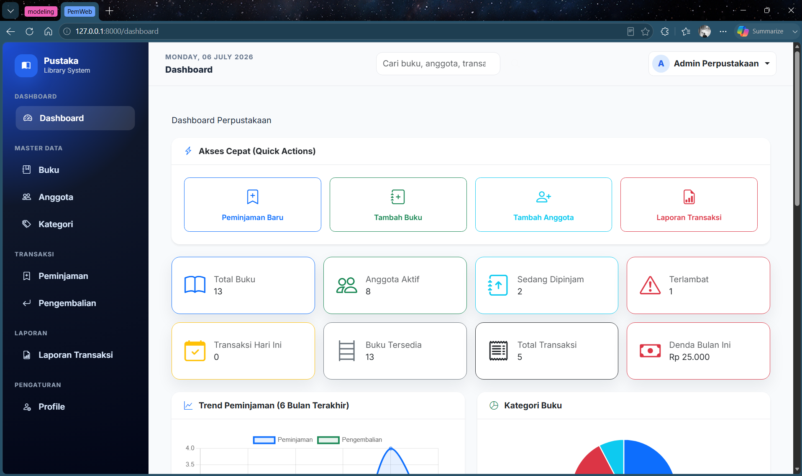
```

---

## 📚 Daftar Buku

Menampilkan seluruh koleksi buku beserta informasi dan stok yang tersedia.

```md
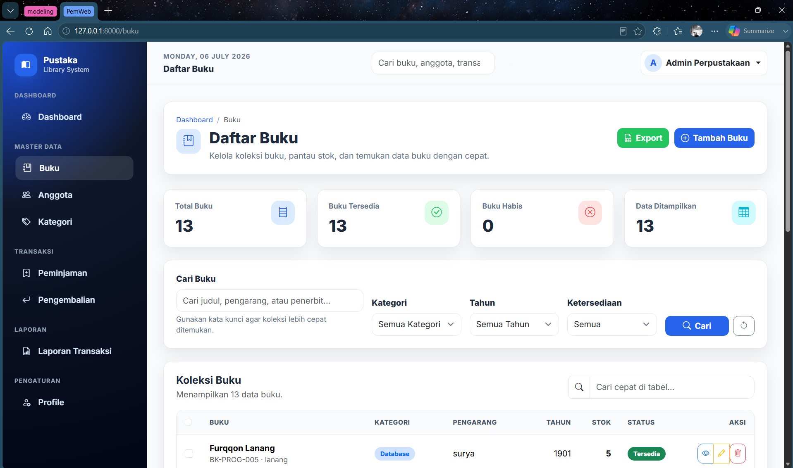
```

---

## 📖 Detail Buku

Menampilkan informasi lengkap mengenai buku yang dipilih.

```md
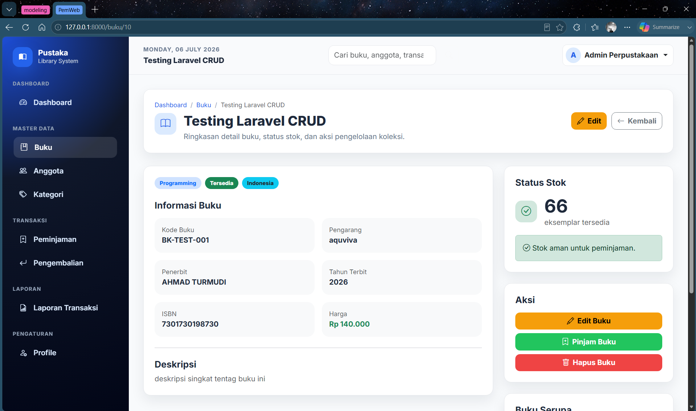
```

---

## 👥 Daftar Anggota

Halaman pengelolaan seluruh anggota perpustakaan.

```md
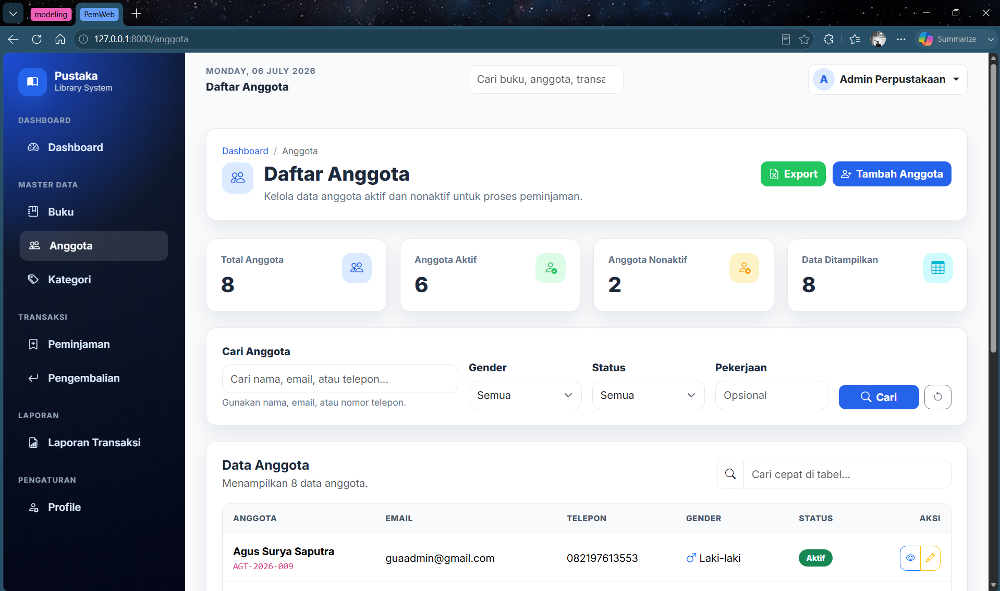
```

---

## 📋 Daftar Transaksi

Menampilkan seluruh riwayat peminjaman dan pengembalian buku.

```md
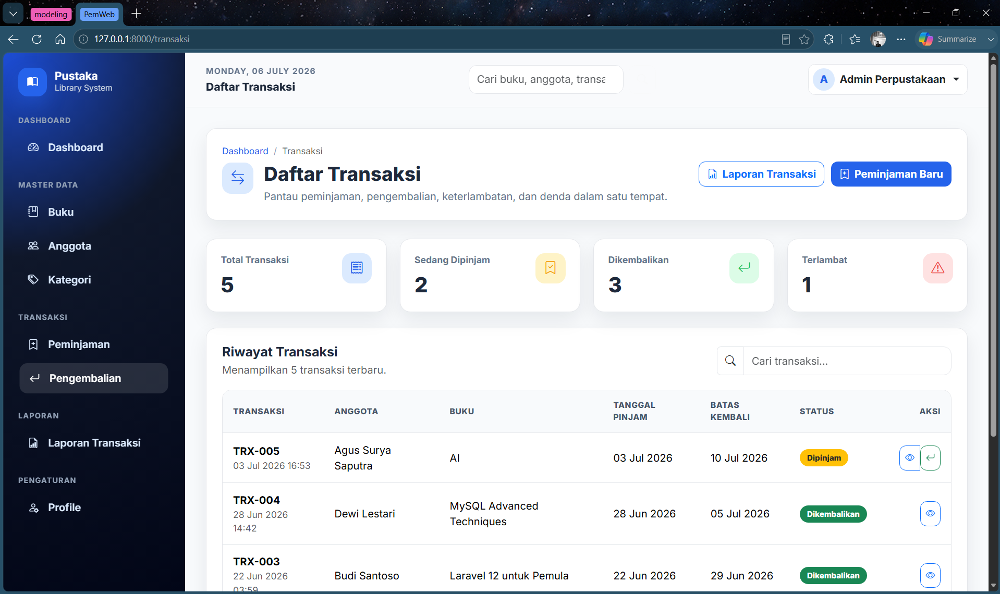
```

---

## 📚 Form Peminjaman

Form untuk melakukan transaksi peminjaman buku.

```md
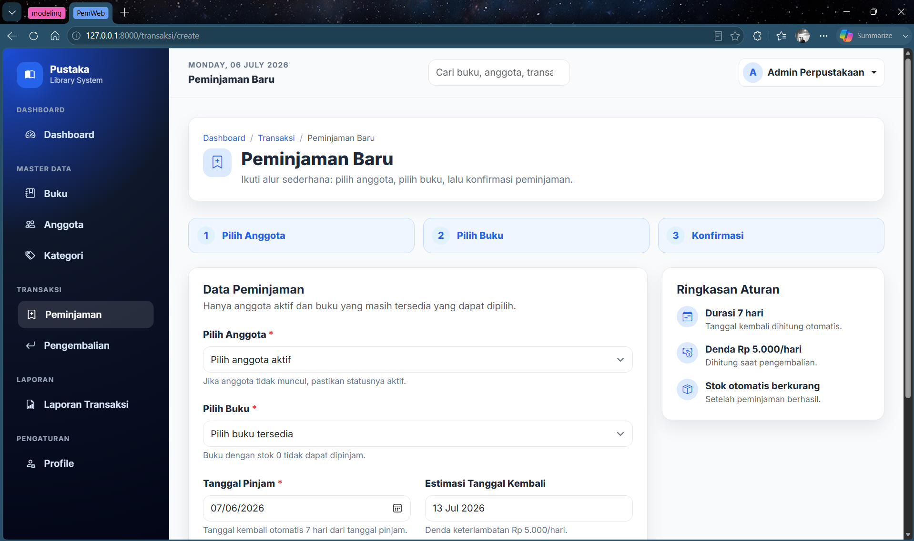
```

---

## 🔄 Detail Pengembalian

Menampilkan informasi pengembalian beserta status dan denda apabila terjadi keterlambatan.

```md
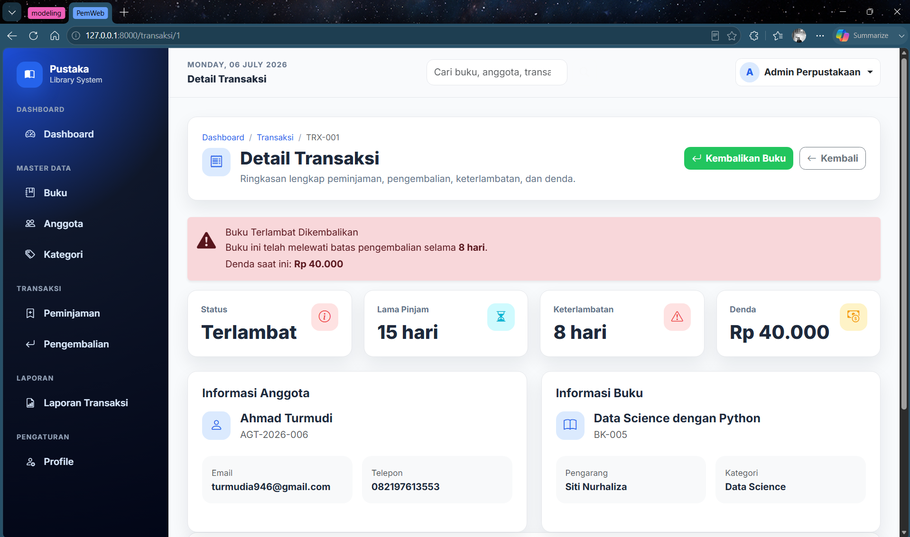
```

---

## 📈 Halaman Laporan

Laporan transaksi dengan berbagai filter untuk mempermudah analisis data.

```md
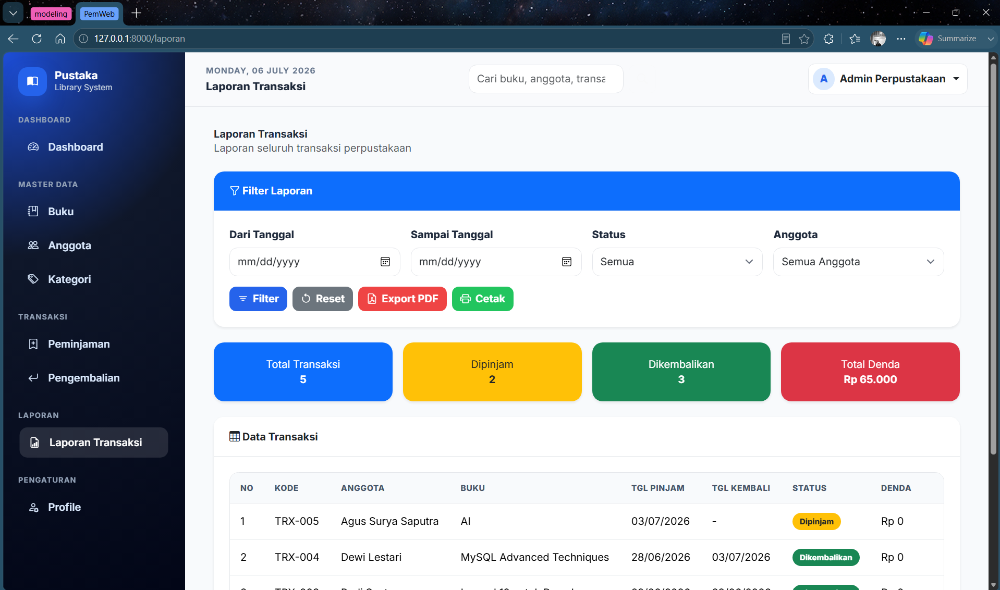
```

---

## 📄 Export PDF

Mendukung pembuatan laporan dalam format PDF sehingga mudah dicetak maupun diarsipkan.

```md
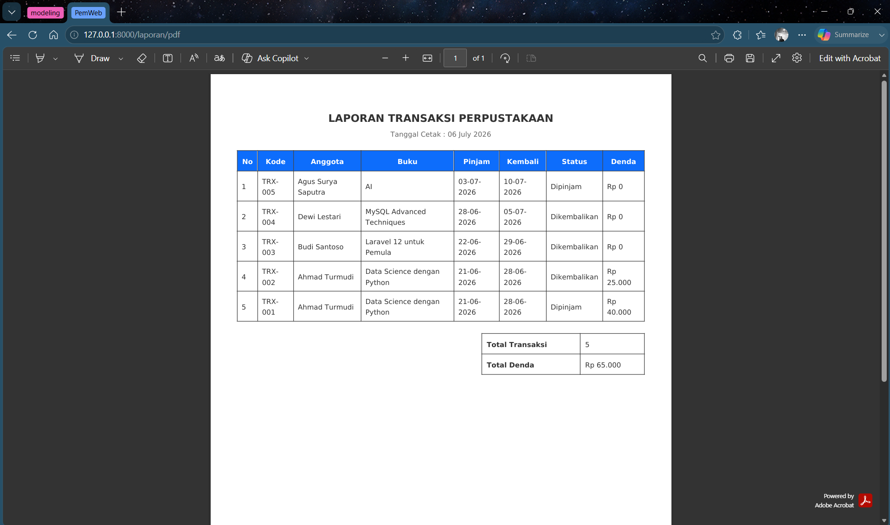
```

---

## 🔍 Search

Mempermudah pencarian data secara cepat berdasarkan kata kunci tertentu.

```md
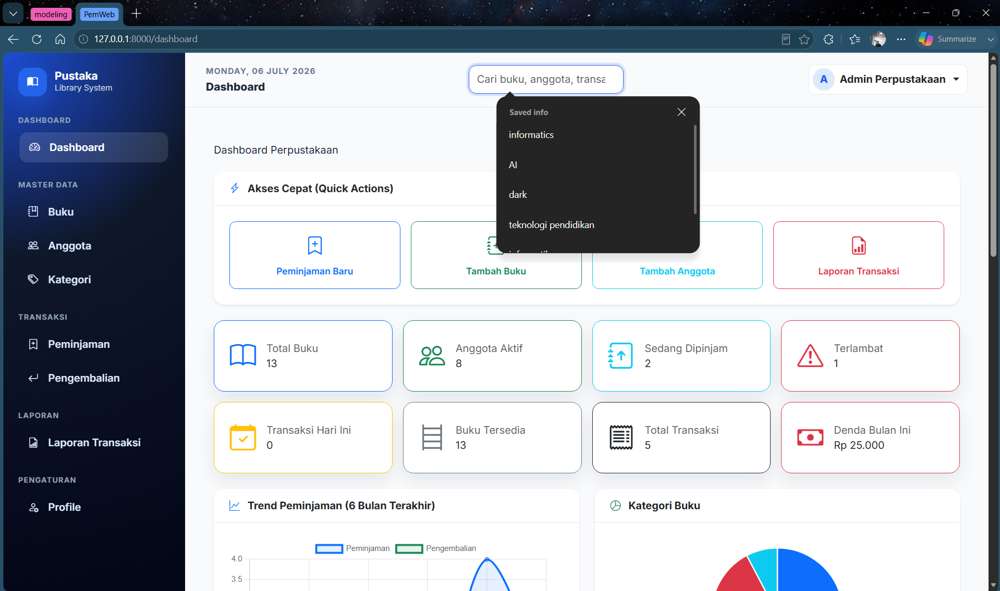
```

---

## 📊 Dashboard Analytics

Visualisasi data menggunakan grafik dan statistik untuk membantu proses monitoring.

```md
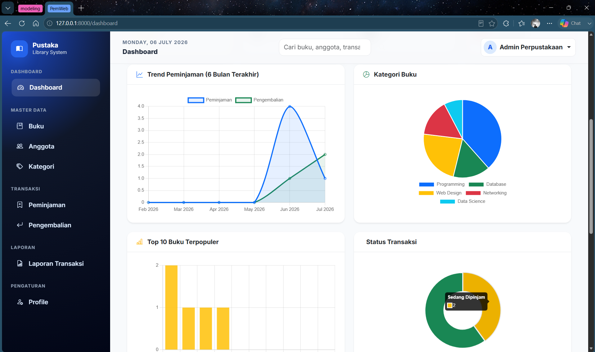
```

---

# 🛠️ Tech Stack

| Teknologi   | Keterangan           |
| ----------- | -------------------- |
| Laravel 13  | Backend Framework    |
| PHP 8.4     | Programming Language |
| MySQL       | Database             |
| Blade       | Template Engine      |
| Bootstrap 5 | User Interface       |
| Vite        | Asset Bundler        |
| Composer    | Dependency Manager   |

---

# ⚙️ Instalasi

```bash
git clone https://github.com/username/pustaka-app.git

cd pustaka-app

composer install

npm install

cp .env.example .env

php artisan key:generate

php artisan migrate

npm run build

php artisan serve
```

---

# 📂 Struktur Project

```
app/
database/
public/
resources/
routes/
storage/
```

---

# 🚀 Pengembangan Selanjutnya

Beberapa fitur yang dapat ditambahkan pada versi berikutnya:

* Role & Permission (Admin, Petugas, Anggota)
* Barcode / QR Code Buku
* Scan Barcode saat Peminjaman
* Email Notifikasi Pengembalian
* Export Excel
* Import Data Excel
* Dashboard Statistik yang lebih interaktif
* REST API
* Dark Mode

---

# 👨‍💻 Author

**Ahmad Turmudi**

Mahasiswa Informatika

---

# 📄 License

Project ini dikembangkan sebagai media pembelajaran dan implementasi Sistem Informasi Perpustakaan menggunakan Laravel.
